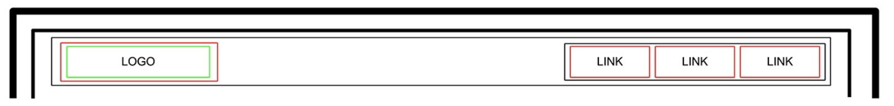
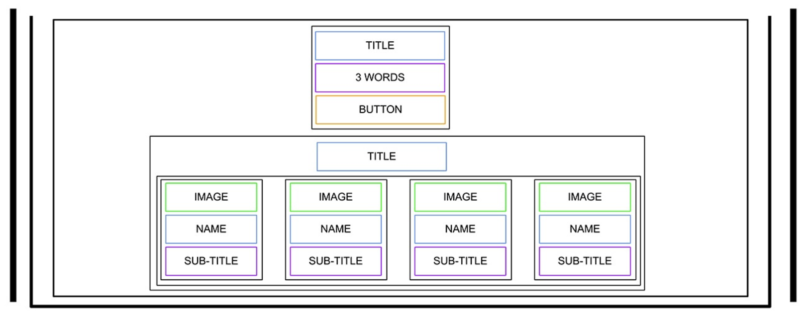
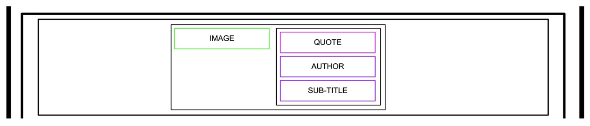
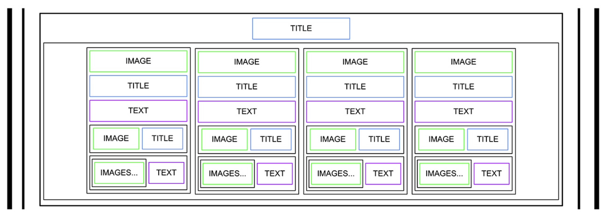
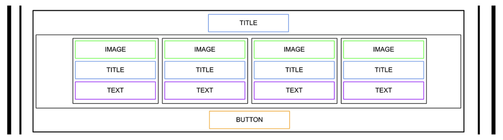
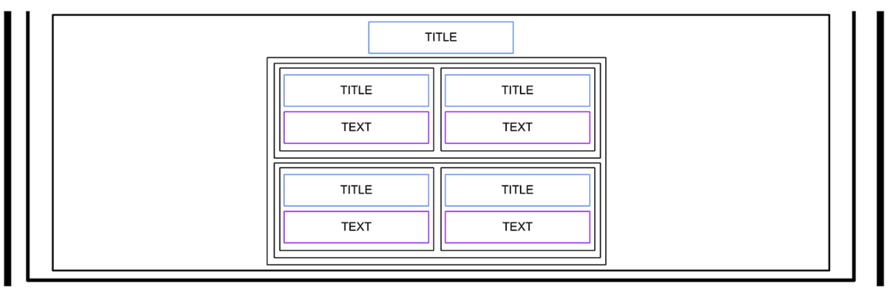
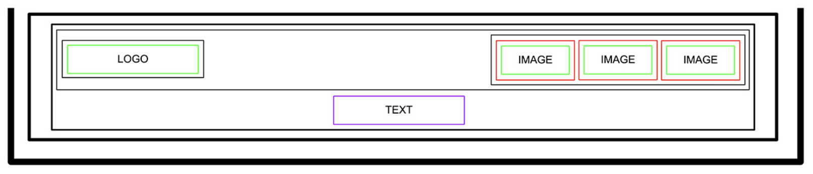

### HTML, advanced

## General

What is HTML
How to create an HTML page from a wireframe
What is a markup language
What is the DOM
What is an element / tag
What is an attribute
What the purpose of each HTML tag

## Requirements

All your files should end with a new line
A README.md file, at the root of the folder of the project is mandatory
You are not allowed to install, import or use external libraries. This website must be build with only HTML/CSS/JavaScript. No NodeJS, React, VueJS, Bootstrap, etc.
Your code should be W3C compliant and validate with W3C-Validator

## Tasks

# Task 0 - README and Objectives

Create README.md file for the whole project to create below front-end with html as below:

- GitHub repository: holbertonschool-web-development
- Directory: html_advanced
  

# Task 1 - Header

Create the HTML skeleton (html, head, body, etc.)
In the body, add a header tag
Inside this header:
Add a link element with an image inside
Add a block of 3 link elements

# Task 2 - Banner

Add a main tag that has a section element inside.
In this section element, add:

A block containing:
A heading tag (level 1, don’t forget to use the correct heading value)
A text element
A button tag
Another block containing:
Another heading tag (level 2, be careful about which one you are using)
A block containing 4 blocks - each block containing:
An image
A heading tag (level 3)
A text

# Task 3 - Quote

The quote section is inside the main:

Create a new section for the quote
Inside, add a block containing:
An image
Another block with inside:
A blockquote tag
A text tag for the quote author
Another text

# Task 4 - Videos

New section containing:

A heading tag (level 1)
A block containing the 4 video blocks - each of them are composed with:
An image
A heading (level 2)
A text
Add a block for the author information:
An image
A heading (level 3)
A block for the rating:
A block of images (one star = one image)
A text

# Task 5 - Membership

After the videos list section, add a new section containing:

A heading (level 1)
A block containing 4 block items - each block containing:
An image
A heading (level 2)
A text
A button

# Task 6 - FAQ

Add a section for the FAQ containing:

A heading (level 1)
A block that contains 2 “row blocks”
Each “row block” contains 2 “item blocks”
Each “item block” is composed of:
A heading (level 2)
A text
Hint: There is no “row block” tag, “row” is referring to the styling that will be applied in a future project. It just means two “rows” containing two “items” each, also containing their own elements.

# Task 7 - Footer

After the last section, outside of the main, add a footer:

A block (used later for centering the footer content), inside this block:
Another block with:
An image
Another block containing:
3 Images with link
A text

